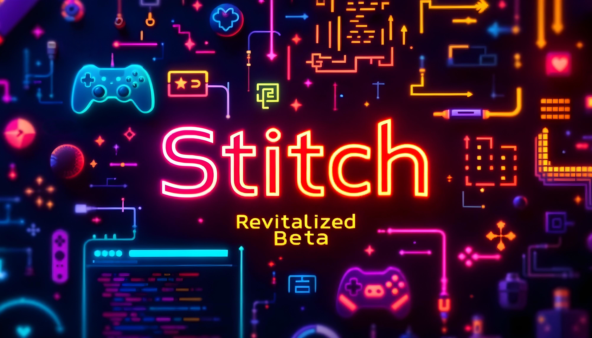

# Stitch Revitalized (for Roku)
# COMING SOON

Stitch Revitalized is a Roku channel that aims to provide an actively maintained, reasonably feature-complete Twitch experience while respecting Twitch's business model (ads, monetization, and the like). This channel is based on the now archived Stich channel https://github.com/0xW1sKy/Stitch-For-Roku (Nov 24, 2024).

Stich Revitalized exists because Twitch does not presently have any official channel for Roku, despite [Roku being the most popular smart TV platform, with (as of early 2022), a 39% market share in North America and a 31% market share worldwide](https://seekingalpha.com/article/4547471-the-sleeping-giant-in-streaming-turning-roku-into-a-huge-2023-winner). If Stitch becomes active or Twitch makes a official app, this project will no longer be maintained.

## Installation

You can add Stitch Revitalized to your Roku account by clicking the following link: (coming soon)

You can install the beta channel at: https://my.roku.com/account/add/NR9GXRQ (limited to 20 installs)

## Contributing

If you are comfortable using the GitHub interface, you can report bugs or request features by opening a [GitHub Issue](https://github.com/Narehood/Stitch-Revitalized-For-Roku/issues). (Please check to see if your issue has already been reported before opening a new one.)

In addition to issues, Pull Requests are welcome. All contributions must be made [under the Unlicense](./LICENSE).

## Authorship and License

Stitch began as a hard fork of [Twoku](https://github.com/worldreboot/twitch-reloaded-roku), due to that application's apparent abandonment. Since then Stitch has been almost completely rewritten.

Twoku was released without an explicit license, but, as a non-cleanroom rewrite, all subsequent contributions to Stitch are released [under the Unlicense](./LICENSE).

If license encumberance is an issue for you, you can compare [the final upstream commit to this repository](https://github.com/0xW1sKy/Stitch-For-Roku/commit/268187c63e1eaf3922f577a2dab6ccb6a2e089f8) to see what code is unclearly licensed.

While removing any residual upstream code is not a priority for Stitch, Pull Requests replacing unclearly licensed code with unencumbered code are welcome.

Stitch Revitalized is released on a non-commercial basis and derives no revenue. If you work for Twitch, please feel free to use the license-unencumbered portions of this repository as the basis for an official Twitch app.
